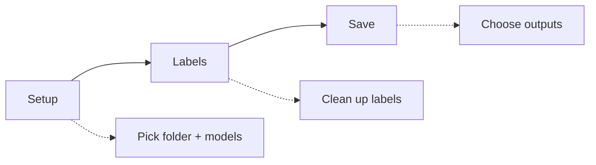

import AppShot from "@site/src/components/AppShot";

# Analyse a folder

A one-off run over a single folder of images or videos. Three steps, then you get files out. Nothing is stored as a long-term project unless you promote the run to one at the end.

<AppShot name="folderRun1Setup" />

## The three steps

### 1. Setup

Pick the folder to analyse and choose the models: a detector (finds animals, people, vehicles) and optionally a classifier (names the species). Start the run.

### 2. Labels

Once the AI has run, review and clean up the labels. Adjust the detection threshold, relabel, and filter by species. This step is optional: skip it if you just want the raw output.

### 3. Save

Choose what to write out:

- complete detection tables
- a recognition file for Timelapse
- species-separated folders
- visualised or blurred images

Outputs land in the analysed folder by default.

:::tip Turn a run into a project

After saving, you can promote the folder run into a project to keep tracking those cameras over time. See [Projects](../projects/overview.mdx).

:::

## Timelapse integration

Windows only, because Timelapse itself is Windows only. In Timelapse, choose `Recognitions` > `AddaxAI Image Recognizer` > `Run AddaxAI recognizer on a folder…`. AddaxAI opens "Analyse a folder" with that folder filled in. Run it and keep the recognition file enabled in the save step. When it finishes, AddaxAI writes `addaxai-recognitions.json` next to your images. In Timelapse, go to Recognition > Import recognition data for this image set and pick that file.
