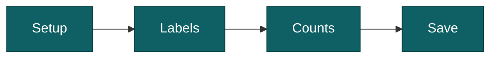

import AppShot from "@site/src/components/AppShot";
import TutorialVideo from "@site/src/components/TutorialVideo";

# Analyse a folder

A one-off run over a single folder of images or videos. Four steps, then you get files out. The two middle steps are optional.

## Video tutorial

Prefer to watch? This video walks through the whole run, from picking a folder to saving the results.

<TutorialVideo id="FFaKBsPNrvI" title="Video: analyse a folder" />

## 1. Setup

Pick the folder and the models: a detector to find animals, people and vehicles, and a classifier to name the species. Start the run.

<AppShot name="folderRun1Setup" />

## 2. Labels

When the AI is done, you can check the labels. Relabel, filter by species, or refine the results by changing the thresholds and intervals. Skip this step if you just want the raw output.

<AppShot name="folderRun2Labels" />

## 3. Counts

The AI groups the files into events, one per visit, and counts how many animals of each species it saw in each. Check those numbers and confirm or change them, the same way as on the Counts page of a project. Your numbers go into the counts table the Save step writes. Skip this step to keep the AI's counts. See [confirm the counts](./confirm-counts.mdx).

<AppShot name="folderRun3Counts" />

## 4. Save

Choose what to write out: the tables (summary, counts, detections, files), a recognition file for Timelapse, species folders, or marked-up images. By default files land in the folder you analysed, but you can change where they go.

Species folders copy your images and videos into one folder per species, or nested by taxonomy. Each file goes in one folder only, the species of its strongest detection. Your originals are never moved. Boxes and blur are drawn on images; a video cannot be drawn on, so a video gets a still image with the boxes saved next to it, and with blur on a video is saved as a blurred still only. This is only available in a folder run, not in a project.

<AppShot name="folderRun4Save" />

## Timelapse

Using Timelapse to review your photos? See [use results in Timelapse](./timelapse.mdx).
