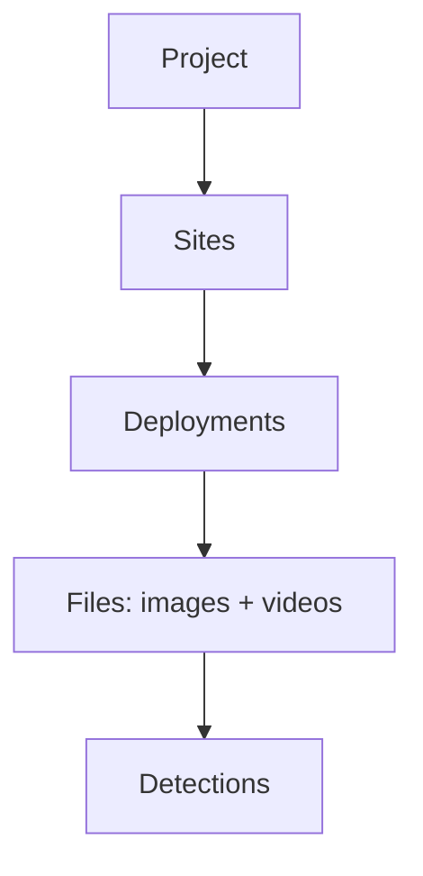

import AppShot from "@site/src/components/AppShot";

# Projects

A project is a stored workspace for tracking cameras over time. Where a folder run is one-and-done, a project keeps everything: detections, verification history, species counts, and the analyses built on top of them. It is additive, so you keep adding deployments and the dashboards, maps, and stats update with them.

## Structure

A project organises data in a hierarchy:

- **Site**: a physical camera location, with coordinates.
- **Deployment**: one period a camera was recording at a site, backed by a folder of files.
- **File**: an image or video, with its capture time.
- **Detection**: an animal, person, or vehicle found in a file, with a species label once classified.

## Check the results

On the Edit page you go through the detections and confirm or correct the species. Human edits always win over the AI and are never overwritten. Similar-looking animals can be grouped and labelled together.

<AppShot name="verify" />

## Watch the data build up

As you add and confirm deployments, the Dashboard and Insights fill in: species counts, activity patterns, trends, and a map of your sites.

<AppShot name="dashboard" />

## Camera timezone

Each project has a camera timezone. Capture times are stored exactly as the camera recorded them, and the app always shows that wall-clock time, not your browser's local time. Set the timezone to match how the cameras were configured.
