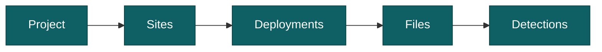

import AppShot from "@site/src/components/AppShot";
import AppGallery from "@site/src/components/AppGallery";

# Build a project

A project is a stored workspace where your results become insight: counts, maps, rates and trends. Where a folder run is one-and-done, a project keeps everything: detections, verification history, species counts, and the analyses built on top of them. It is additive, so you keep adding deployments and the dashboards, maps, and stats update with them.

## Structure

A project organises data in a hierarchy:

- **Project**: the whole study, holding all its sites and their data.
- **Site**: a physical camera location, with coordinates.
- **Deployment**: one period a camera was recording at a site, backed by a folder of files.
- **File**: an image or video, with its capture time.
- **Detection**: an animal, person, or vehicle found in a file, with a species label once classified.

## Add deployments

Add each camera period as a deployment and point it at that folder of files. AddaxAI works through them in a queue, one after another.

<AppShot name="processQueue" />

## Import from a spreadsheet

If you already keep your cameras in a spreadsheet, you can add them in one go instead of typing each one. Save your sheet as a CSV file and use "Import from CSV". There are two separate imports:

- **Sites**, on the Sites page. Columns: `name`, `latitude`, `longitude`, and optionally `elevation_m`, `habitat_type` and `notes`.
- **Deployments**, on the Process page. Columns: `folder`, and optionally `site` and `notes`. The `folder` column holds the full path to the folder with the images or videos. The `site` column holds the name of a site that already exists, so import your sites first. Leave it empty to set the site later.

Numbers always use a dot as the decimal separator, like `52.0907`, and never a thousands separator. If your spreadsheet writes `52,0907`, replace the commas with dots before you save the file.

Both dialogs offer an example file to download, and both show you what would be created before anything is saved. If any row has a problem, nothing is imported: you fix the file and choose it again. That way you never end up with half a survey and no way to undo it.

Deployment folders need no dates. AddaxAI reads the capture times from the files themselves when it analyses them.

## Refine as you go

You don't have to get the structure right the first time. Add your folders and start checking results. Two things add more later:

- Give a deployment a site with coordinates, and it shows up on the map.
- Split a folder into separate deployments, one camera period each, for a correct Camtrap DP export.

Do both anytime on the Sites and Deployments pages. AddaxAI reminds you where it matters, like on the map or in an export.

<AppShot name="sites" />

## Check the AI labels

On the Labels page you go through the detections and confirm or correct the species. Human edits always win over the AI and are never overwritten. Similar-looking animals can be grouped and labelled together. See [check the labels](./check-labels.mdx) for how it works.

<AppShot name="verify" />

## Confirm the suggested counts

For each event, AddaxAI suggests a count: the most animals seen together in a single photo. On the Counts page you confirm or correct that number, and it feeds the rates and charts. Recommended after the labels. Counting works best once the labels are clean, with less noise to sort through. See [confirm the counts](./confirm-counts.mdx) for how it works.

<AppShot name="counts" />

## Watch the data build up

As you add data, the Dashboard and Insights fill in: species counts, activity patterns, trends, and a map of your sites.

<AppGallery names={["dashboard", "map", "activity", "timeline", "confusionMatrix", "perClass"]} />
