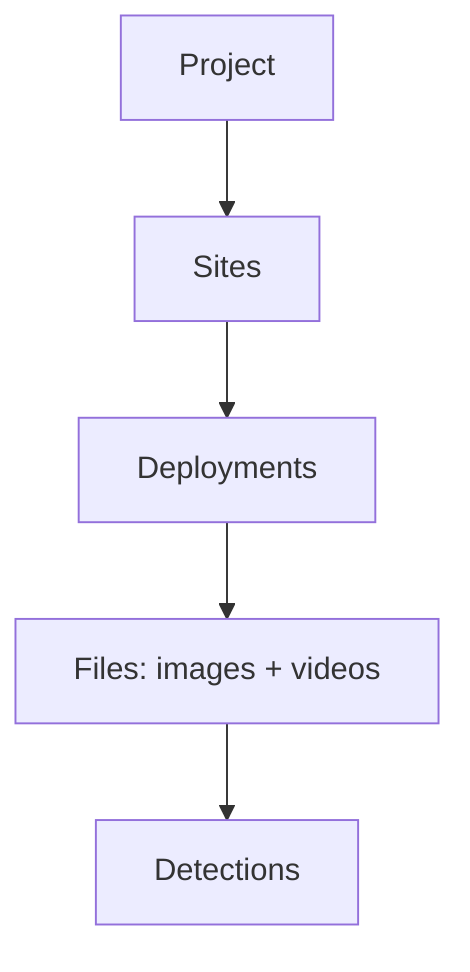

# Projects

A project is a stored workspace for tracking cameras over time. Where a folder run is one-and-done, a project keeps everything: detections, verification history, species counts, and the analyses built on top of them. It is additive, so you keep adding deployments and the dashboards, maps, and stats update with them.

## Structure

A project organises data in a hierarchy:

- **Site**: a physical camera location, with coordinates.
- **Deployment**: one period a camera was recording at a site, backed by a folder of files.
- **File**: an image or video, with its capture time.
- **Detection**: an animal, person, or vehicle box found in a file, with a species label once classified.

## What you can do

- **Edit**: review and confirm detections and species counts. Human verifications always win over model output and are never overwritten.
- **Dashboard**: a glanceable summary of the project.
- **Insights**: deeper, scientifically grounded views. See [Insights](../insights/overview.md).
- **Export**: write out to Camtrap DP and other formats.

## Camera timezone

Each project has a camera timezone. Capture times are stored exactly as the camera recorded them (naive wall-clock time), and the app always shows that wall-clock time, not your browser's local time. Set the timezone to match how the cameras were configured.
